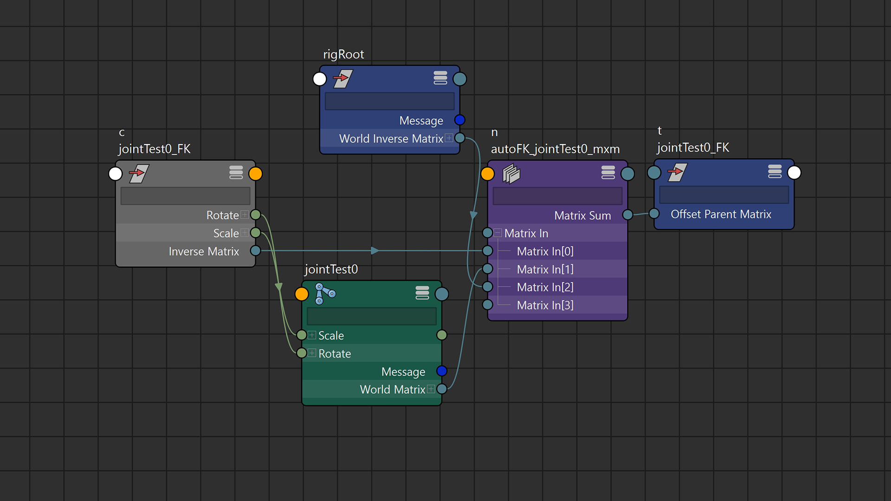

# explainer the video.md
### Youtube: Overthinking FK Controllers

posted on YYYYMMDD

⬅ youtube link

full explainer below, but first::

> ## postscript 1: the outliner deal
> the outliner in the video looked something like this:
> 
> 
> the underlying node graph looks like this:
> 
> 
> i'll be honest, a lot of groups containing each controller is not a good look! (it's a lot like having individually-wrapped sweets and sometimes people just want multiples at a go) 
>
> this is because the offsetParentMatrix node wasn't utilised when i was learning my way around matrix transforms in maya prior to embarking on this project, and i hadn't shaken the need to have pre-transform groups from the early experimentation for this video
> 
> this attribute is a relatively recent addition to Maya, specifically for cleaning up pre-transform groups in the outliner and relying less on transform-specific constraint nodes<sup>a1</sup>
> 
> > <sup>a1</sup> [Maya 2020 - What's New (jump tag: Rigging Improvements)](https://help.autodesk.com/view/MAYAUL/2020/ENU/?guid=GUID-AEFFDE75-1F81-4E38-B1D9-9E4C4D23939C#GUID-AEFFDE75-1F81-4E38-B1D9-9E4C4D23939C__SECTION_828DC6F0D7C34254BAFD8932AC2AE278) <br/>
> > <sup>a1</sup> [yt: Empowering rigs using Offset Parent Matrix [MAYA 2020]](https://www.youtube.com/watch?v=JOYMV-bQdlM)
> 
> ideally (as of posting, reflected in the python script) the outliner should look like this:
> 
> a lot cleaner!
>
> the graph would look like this:
> 
> 

## the rig

most simple rigs have hierarchal chains of controls (i.e. controls parented to controls before it), mirroring the hierachy of the bind joint chain. said system may also contain `parent` or `transform constraints` done to maintain positions in more complex rigs (e.g. FK controls at the end of an IK chain). these would depend on the joints being finalised, and would require additional adjustments to reflect on changes to the joints. more constraint nodes will be required to ensure above positional conformity.

the process in this video addresses this through matrix maths: it makes distinctions of each FK control from each other, and reduces the width of the outliner by not arranging them according to joint hierachy.


⬆ simple FK control scheme comparison with hierachy-mirrored controls and matrix-offset controls

that has a side effect that if the joint is directly moved after the fact, the controls will also follow. to achieve the same effect in a hierachal control, the `transform` component of the joint is connected to the `transform` of the control; alternatively it could be composed and plugged into the `parentOffsetMatrix` to free up the `transform` component of the controller itself, but it is usually not worth the complexity with the additional nodework above simple connections between existing objects

as DG nodes are not visible in the outliner by default, the outliner would not be overwhelmed by additional nodes to the list of objects (DAG nodes) visible in the scene

the matrix system also enforces selection independence, which avoids maya's default behaviour of highlighting downstream nodes (childs) in scene selection. selection independence is desired to show which control is explictly selected by the animator, and child highlighting works against that.


⬆ selection comparison with hierachy-mirrored controls and matrix-offset controls

one of the ways to prevent that is to turn off the attribute in each object, and ensure maya preferences (settings > selection > selection child highlighting) is set to "use object highlight setting". the downside of the matrix system is that there is no way to allow child highlighting when the user may want it, as all the controls are not in the same hierarchal chain.

## the script

⬅ [github: maya script editor demo](img/2024/autoFKtest.py)

the scripting process in this video performs upon the above rigging theory, and will continue to be expanded upon with other rigging operations.

⬅ [github: rigStu rAutoFK file](https://github.com/STUAAAAAAAAAART/rigStu/devPython/rAutoFK.py) <br/>
⬅ [github: rigStu repo root](https://github.com/STUAAAAAAAAAART/rigStu)

most of the script can be done with just maya.cmds commands, but this project has variables with openMaya MSelectionList containing pointers to MObjects, instead of just the string names of the scene objects.

this is because rename commands done by the user or maya will be reflected in those MObjects, and the equivalent (if openMaya is not used) will require additional query and string variable updates around the project.

(for example: running a maya.cmds rename command and also editing a string variable to ensure the right object gets called correctly. doing the openmaya way does not require another string variable to get the object again)

so most of the core script is made, so that the command to "make an FK controller from this list of joints" is simply:

```py
# --> inbound om2.MSelectionList of joints. or:
inList = om2.MGlobal.getActiveSelectionList()

outList = rAutoFK(inList) # <-- returns list of created DG and DAG nodes
```

as mentioned in the [repository root](https://github.com/STUAAAAAAAAAART/rigStu), the script is meant to run standalone at the moment, as making a full plugin and migrating functions to fully-fledged undoable commands on openmaya would require more study on the API. my the focus would be to have the common rigging operations and nodework condensed into functions first